# Solution: GCP Metadata Exploitation via SSRF

---

# Architecture Overview

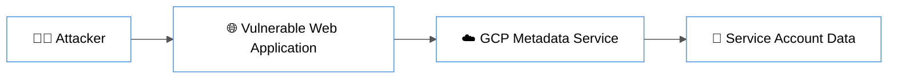

---

## 1. Reconnaissance

The target web application was accessed via:

http://34.70.102.215/index.html

The homepage did not contain any visible input fields. Further enumeration led to the discovery of:

- /job_search.html

This page contained a form with multiple input fields.

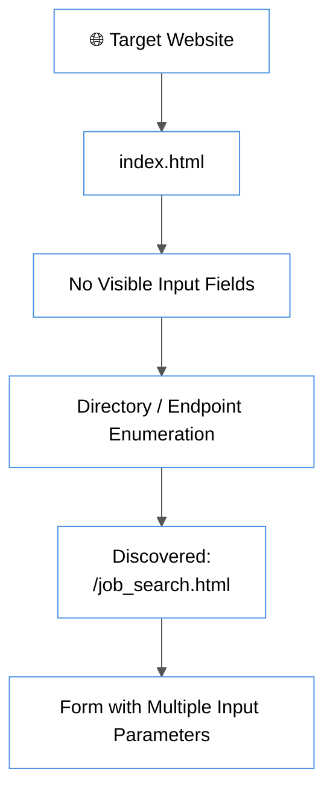

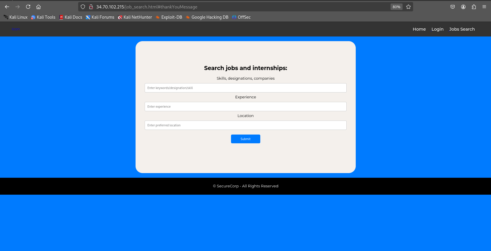

---

## 2. Vulnerability Identification

The following parameters were identified:

- url
- organization
- ip

Initial testing showed that the application accepts user-supplied URLs and processes them on the backend.

### Why this indicates SSRF:
If a server fetches user-provided URLs, it can be forced to access internal resources (like metadata services), which are normally inaccessible externally.

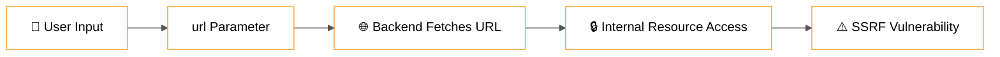

---

## 3. Exploitation (SSRF)

The vulnerability was exploited by injecting the following payload into the `url` parameter:

http://metadata/computeMetadata/v1/

### Why this URL?
- `metadata` resolves internally to `169.254.169.254`
- This is a special IP used by cloud providers (GCP) to expose instance metadata
- It is only accessible **from inside the VM**, not from the internet

### Why SSRF works here:
The application backend makes the request on our behalf, allowing us to access internal resources.

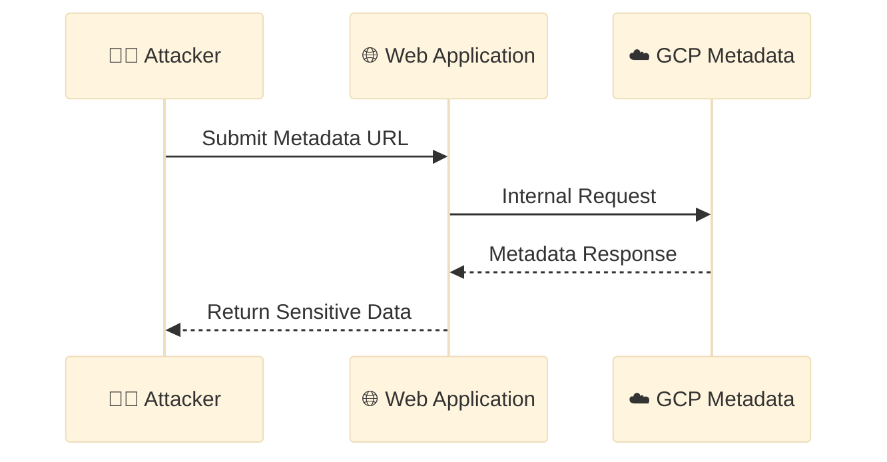

---

## 4. Why NOT Use Commands like curl in Input

Several attempts were made using payloads such as:

- `; curl ...`
- `$(curl ...)`
- `` `curl ...` ``

### Why these failed:
- The application does **not execute shell commands**
- It likely uses a function such as:
  - `file_get_contents()`
  - or similar HTTP-fetching logic

### Key Insight:
- Input is treated as a **URL**, not as a command
- Therefore, command injection (RCE) is not possible here
- Only SSRF-based exploitation works

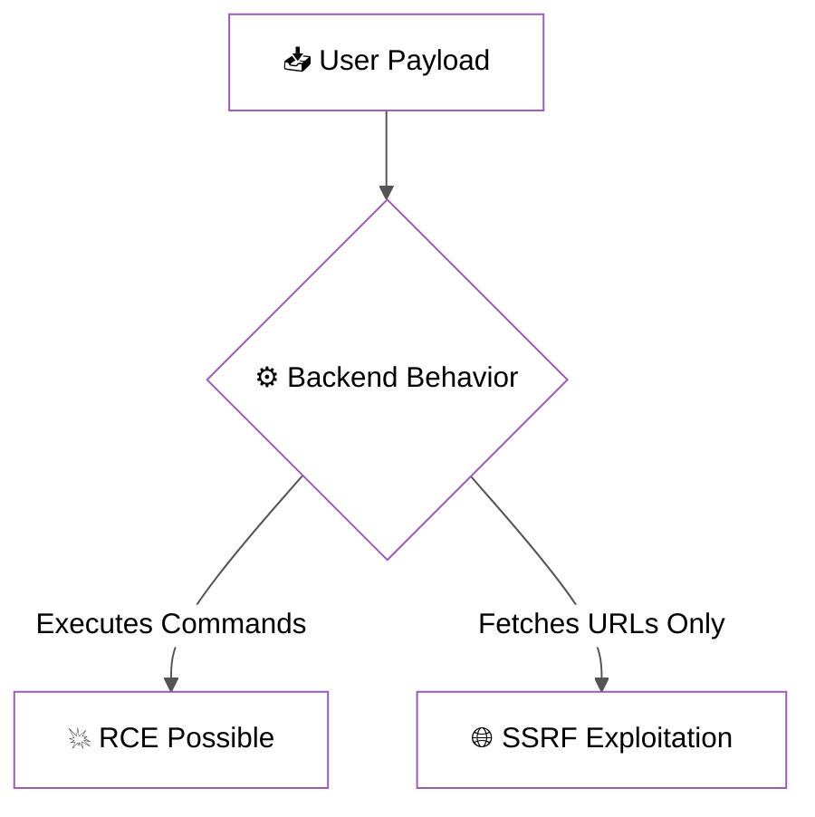

---

## 5. Metadata Enumeration

Once SSRF was confirmed, metadata enumeration was performed:

http://metadata/computeMetadata/v1/

This returned:

- instance/
- oslogin/
- project/

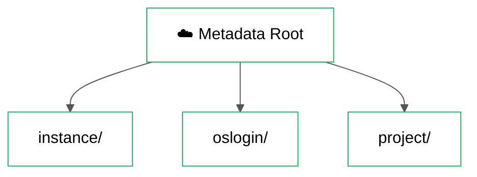

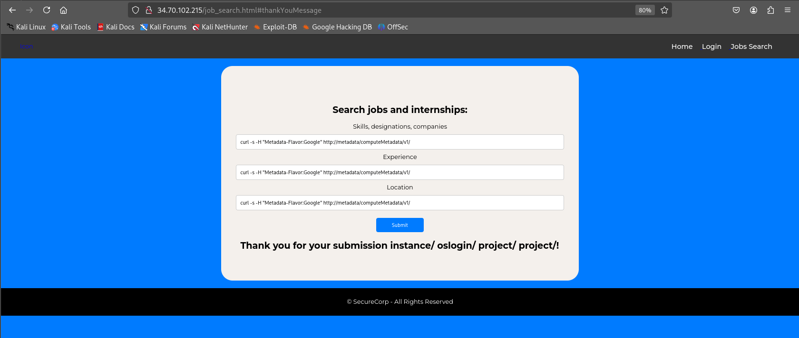

---

### Why further enumeration is required:
Metadata services are structured like directories. Sensitive data is stored in nested paths.

---

## 6. Service Account Enumeration

Next, the following endpoint was accessed:

http://metadata/computeMetadata/v1/instance/service-accounts/

This revealed:

- default/

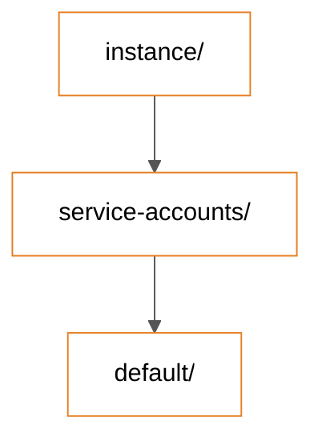

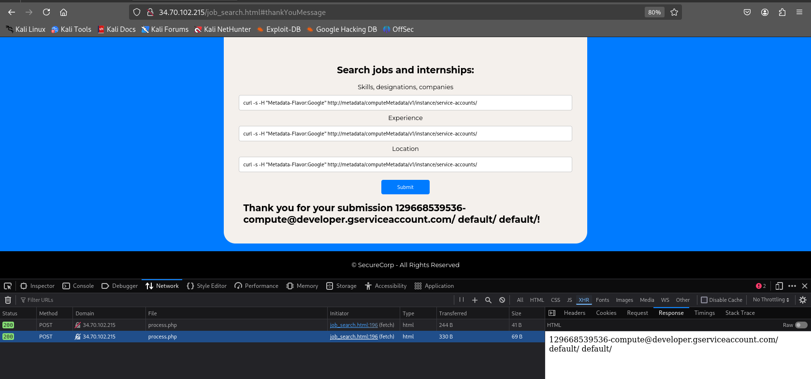

Further enumeration:

http://metadata/computeMetadata/v1/instance/service-accounts/default/

Returned:

- email
- token
- scopes
- identity

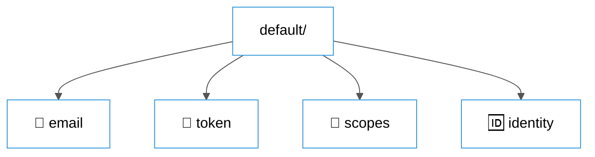

---

## 7. Sensitive Data Extraction

The following endpoint was used:

http://metadata/computeMetadata/v1/instance/service-accounts/default/email

### Why this endpoint?
- It directly returns the **service account identity**
- This is the goal of the challenge
- It confirms compromise of cloud identity

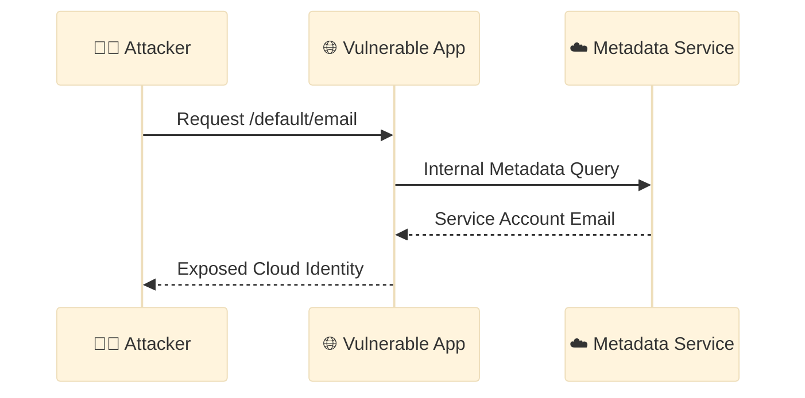

---

## 8. Why This Works Without curl or Headers

Normally, GCP requires:

Metadata-Flavor: Google

However:

- The lab environment allows metadata access without strict header enforcement
- This makes SSRF sufficient without needing full RCE

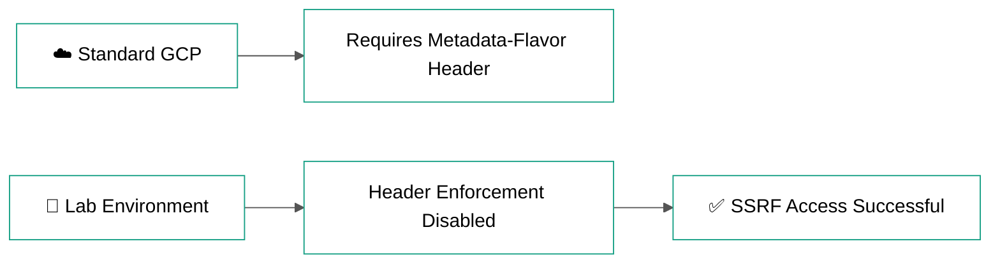

---

## 9. Flag

The recovered Service Account Email ID is:

**129668539536-compute@developer.gserviceaccount.com**

---

## 10. Impact

This vulnerability allows:

- Access to internal cloud metadata
- Exposure of service account identity
- Potential extraction of access tokens
- Risk of privilege escalation in GCP environment

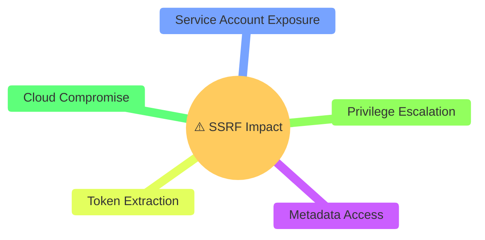

---

## 11. Mitigation

To prevent such vulnerabilities:

- Validate and sanitize all user inputs
- Restrict outbound requests from the server
- Block access to metadata endpoints (169.254.169.254)
- Use allowlists for external requests
- Enforce metadata access protection mechanisms

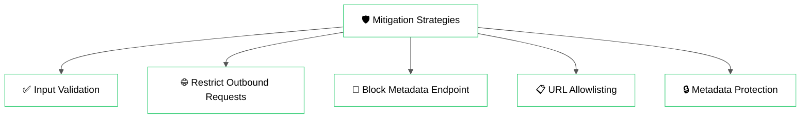

---

## 12. Conclusion

This lab demonstrates how a simple SSRF vulnerability can be leveraged to access internal cloud metadata and extract sensitive information such as service account identity.

The key takeaway is understanding:
- When to use SSRF vs RCE
- How cloud metadata services are structured
- Why internal endpoints must never be exposed indirectly

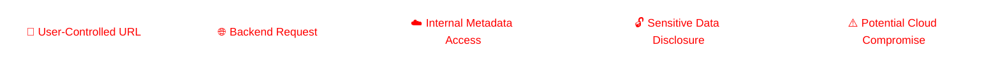