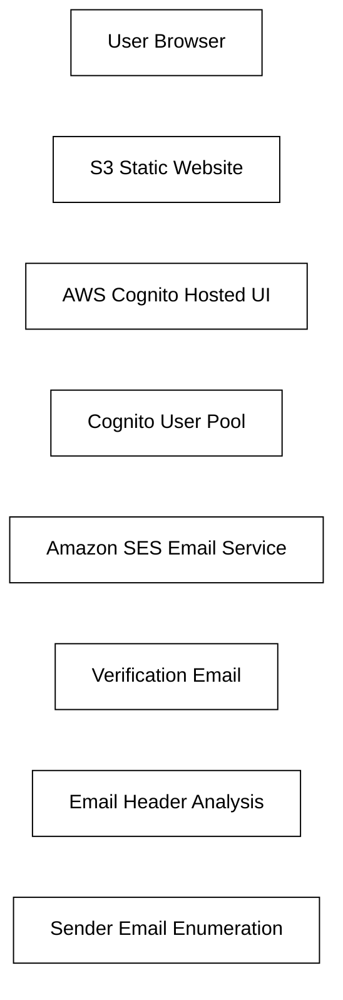

# AWS Cognito Verification Email Enumeration

## Challenge Name
AWS Cognito Verification Email Enumeration

## Difficulty
Easy

---

# Scenario

Secure Corp deployed a Job Portal application using AWS Cognito for authentication and user management.

The organization configured self-registration through an AWS Cognito Hosted UI connected to an S3 static website. During user onboarding, verification emails are automatically delivered to newly registered users.

As a cloud security analyst, your task is to investigate the authentication workflow and identify the email address used by Secure Corp to send verification codes.

---

# Target

```text
http://aws-security-cognito-01-s3-static-website-hosting.s3-website.ap-south-1.amazonaws.com
```

---

# Objectives

1. Access the target application
2. Identify the AWS Cognito Client ID
3. Register a new user using AWS CLI
4. Trigger the verification workflow
5. Analyze the verification email
6. Identify the sender email address

---

# Architecture Diagram



---

# Skills Learned

- AWS Cognito Enumeration
- Cognito Hosted UI Analysis
- AWS CLI Usage
- Verification Workflow Analysis
- Email Header Investigation
- Cloud Authentication Reconnaissance

---

# Tools Required

- AWS CLI
- Web Browser
- Gmail or Any Email Client

---

# Expected Outcome

Identify the email address used by Secure Corp for sending AWS Cognito verification emails.