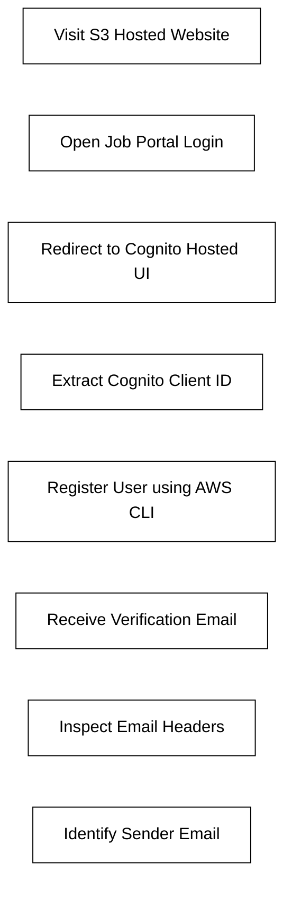
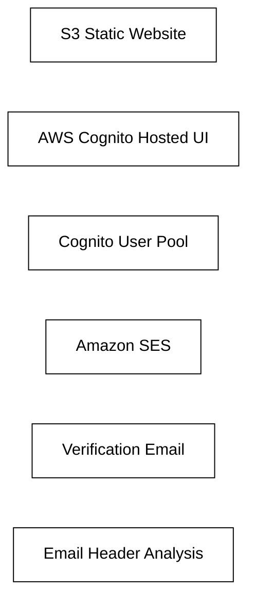

# AWS Cognito Verification Email Enumeration — Solution

## Target

```text
http://aws-security-cognito-01-s3-static-website-hosting.s3-website.ap-south-1.amazonaws.com
```

---

# Objective

Identify the email address used by Secure Corp to send verification codes.

---

# Attack Workflow



---

# Step 1 — Open the Application

Visit the target application:

```text
http://aws-security-cognito-01-s3-static-website-hosting.s3-website.ap-south-1.amazonaws.com
```

Click:

```text
Job Portal Login
```

The application redirects to the AWS Cognito Hosted UI.

---

# Step 2 — Extract Cognito Client ID

Observe the redirected URL:

```text
https://a-ws-security-cog-nito-01.auth.ap-south-1.amazoncognito.com/login?client_id=6h6b6gvm11k0eis3l4vhkhgi67
```

Extract the Cognito Client ID:

```text
6h6b6gvm11k0eis3l4vhkhgi67
```

---

# Step 3 — Register a User Using AWS CLI

Use the following command:

```bash
aws cognito-idp sign-up \
  --region ap-south-1 \
  --client-id "6h6b6gvm11k0eis3l4vhkhgi67" \
  --username "ashrith2026user" \
  --password "InfinityLab@2026Secure123" \
  --user-attributes Name=email,Value=ashrithcyber@gmail.com
```

---

# Command Explanation

| Parameter | Purpose |
|---|---|
| `cognito-idp` | AWS Cognito Identity Provider |
| `sign-up` | Register a new user |
| `--region` | AWS region |
| `--client-id` | Cognito App Client ID |
| `--username` | Username for registration |
| `--password` | Strong password matching policy |
| `--user-attributes` | Email attribute for verification |

---

# Successful Response

```json
{
    "UserConfirmed": false,
    "CodeDeliveryDetails": {
        "Destination": "a***@g***",
        "DeliveryMedium": "EMAIL",
        "AttributeName": "email"
    },
    "UserSub": "91e34dca-3001-70ae-53c7-354f73d4b7c5"
}
```

---

# Step 4 — Check Verification Email

A verification email is received from AWS Cognito.

Open the email and inspect the headers.

Important header:

```text
From: no-reply@verificationemail.com
```

---

# Additional Information Observed

```text
Subject: Your verification code
```

```text
user_pool_id: ap-south-1_sHEW86fei
```

This confirms:
- AWS Cognito is being used
- Amazon SES handles the mail delivery
- Verification infrastructure metadata is exposed

---

# Root Cause Analysis

The challenge demonstrates how attackers or security analysts can:
- Enumerate Cognito authentication workflows
- Analyze verification mechanisms
- Extract metadata from email headers
- Identify internal AWS infrastructure components

---

# Security Risks

## Information Disclosure

The email reveals:
- Sender infrastructure
- Cognito User Pool identifiers
- Verification workflow details
- AWS SES integration

---

# AWS Services Identified



---

# Final Answer

```text
no-reply@verificationemail.com
```

---

# Key Takeaways

- AWS Cognito verification workflows expose useful metadata
- Email headers are valuable reconnaissance sources
- AWS CLI enables direct interaction with cloud authentication systems
- Security teams should minimize metadata exposure in automated emails
```