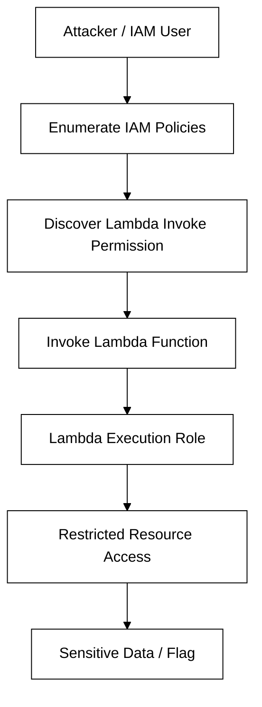
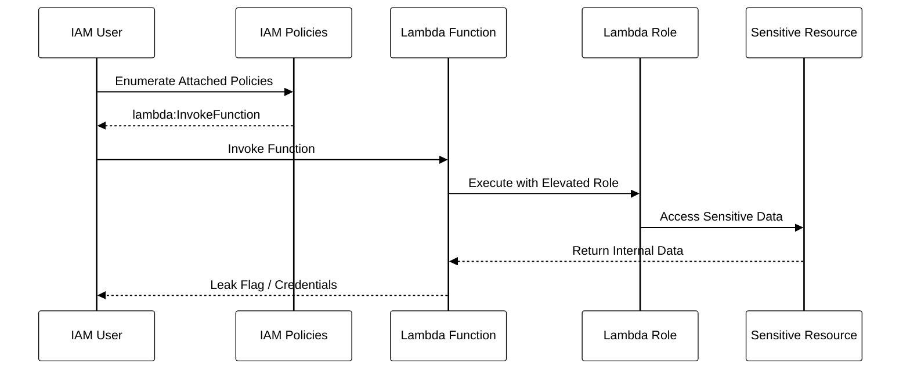

# AWS Lambda Privilege Escalation Lab

## Description

Welcome to Secure Corp’s red team mission! Your assignment, should you choose to accept it, is to infiltrate the cloud environment and assess potential IAM misconfigurations.

Your target? Lambda Functions — where hidden permissions might allow you to escalate privileges and retrieve sensitive data.

Secure Corp has implemented IAM users, roles, and policies to protect its infrastructure. However, recent security audits have flagged potential vulnerabilities in role assignments and Lambda function execution.

Your objective is to simulate an attack, identify security gaps, and capture the hidden flag concealed in the cloud infrastructure.

---

# Scenario

You are provided with credentials belonging to a low-privileged IAM user.

The organization infrastructure contains:

- IAM Users
- IAM Roles
- IAM Policies
- AWS Lambda Functions
- S3 Buckets

The environment may contain privilege escalation paths through misconfigured Lambda execution permissions.

---

# Objectives

- Enumerate IAM resources
- Analyze IAM policies and permissions
- Identify Lambda function access
- Exploit Lambda invocation permissions
- Retrieve the hidden flag

---

# Initial Access

You are given AWS credentials for an employee account.

Example:

```bash
aws configure
```

Validate identity:

```bash
aws sts get-caller-identity
```

---

# Architecture Overview



---

# Key Learning Areas

- AWS IAM Enumeration
- Lambda Permission Analysis
- Privilege Escalation via Lambda
- S3 Enumeration
- Cloud Misconfiguration Exploitation
- Serverless Security Risks

---

# Expected Outcome

Successfully identify the privilege escalation path and retrieve the hidden flag from the cloud environment.

---

# Tools Recommended

- AWS CLI
- Bash
- Linux Terminal

---

# Attack Flow



---

# Rules of Engagement

- Perform only authorized actions within the lab
- Do not modify or destroy resources
- Focus on enumeration and privilege escalation paths
- Use AWS CLI for all interactions

---

# Difficulty

Medium

---

# Category

- Cloud Security
- AWS Security
- IAM Misconfiguration
- Lambda Exploitation
- Privilege Escalation