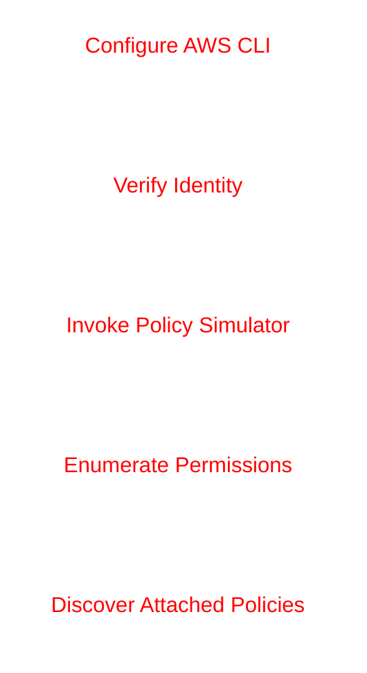

# SimulatePrincipalPolicy Mirage - Solution

## Overview

This challenge demonstrates how an attacker can abuse the AWS IAM Policy Simulator API to enumerate effective permissions assigned to an IAM principal.

The authenticated user possesses the `iam:SimulatePrincipalPolicy` permission, which allows simulation of IAM actions against a target principal.

---

# Attack Flow



---

# Step 1 - Configure AWS CLI

Configure AWS CLI using the provided credentials.

## Command

```bash
aws configure
```

## Example

```txt
AWS Access Key ID: AKIAxxxxxxxxxxxx
AWS Secret Access Key: xxxxxxxxxxxxxxxxx
Default region name: us-east-1
Default output format: json
```

---

# Why This Command?

This command stores AWS credentials locally so authenticated API calls can be made against AWS services.

---

# Step 2 - Verify Current Identity

## Command

```bash
aws sts get-caller-identity
```

---

# Why This Command?

This command verifies:

- Validity of credentials
- AWS account ID
- ARN of the authenticated IAM user

---

# Output

```json
{
    "UserId": "AIDAQ3EGUZMEQ5XI7YUUK",
    "Account": "058264439561",
    "Arn": "arn:aws:iam::058264439561:user/DevAppUser"
}
```

---

# Important Information

The target IAM principal ARN identified:

```txt
arn:aws:iam::058264439561:user/DevAppUser
```

This ARN will be used with the IAM Policy Simulator.

---

# Step 3 - Simulate IAM Permissions

Use `simulate-principal-policy` to determine whether the IAM user can perform specific actions.

## Command

```bash
aws iam simulate-principal-policy \
  --policy-source-arn arn:aws:iam::058264439561:user/DevAppUser \
  --action-names s3:ListBucket
```

---

# Why This Command?

The `simulate-principal-policy` API evaluates whether a principal can perform a specified action without actually executing the action.

It allows attackers to:

- Enumerate permissions
- Identify effective IAM policies
- Discover privilege escalation paths
- Map cloud attack surfaces

---

# Output

```json
{
    "EvaluationResults": [
        {
            "EvalActionName": "s3:ListBucket",
            "EvalResourceName": "*",
            "EvalDecision": "allowed",
            "MatchedStatements": [
                {
                    "SourcePolicyId": "AmazonS3ReadOnlyAccess",
                    "SourcePolicyType": "IAM Policy",
                    "StartPosition": {
                        "Line": 3,
                        "Column": 16
                    },
                    "EndPosition": {
                        "Line": 14,
                        "Column": 4
                    }
                }
            ],
            "MissingContextValues": [],
            "OrganizationsDecisionDetail": {
                "AllowedByOrganizations": true
            }
        }
    ]
}
```

---

# Analysis

The output reveals several critical pieces of information.

## Allowed Permission

```txt
s3:ListBucket
```

The user is allowed to perform this action.

---

# Attached Policy Discovery

The simulator also exposed the attached IAM policy:

```txt
AmazonS3ReadOnlyAccess
```

This confirms that:

- The user has S3 read-only permissions
- Policy information can be enumerated
- Effective access can be mapped without direct policy read access

---

# Security Impact

Granting `iam:SimulatePrincipalPolicy` can expose:

- Effective IAM permissions
- Attached policies
- Privilege escalation opportunities
- Cloud attack surface visibility

Even when direct policy access is restricted, attackers can still enumerate permissions through simulation APIs.

---

# Defensive Recommendations

## Apply Least Privilege

Avoid assigning:

```txt
iam:SimulatePrincipalPolicy
```

unless absolutely necessary.

---

## Restrict Simulation Targets

Limit which principals can be simulated.

---

## Monitor CloudTrail Logs

Detect suspicious usage of:

```txt
SimulatePrincipalPolicy
```

---

## Use Service Control Policies (SCPs)

Restrict dangerous IAM actions across AWS accounts.

---

# Key Takeaways

- IAM Policy Simulator can leak permission information
- Permission enumeration is a critical reconnaissance step
- Attackers can discover effective access without direct policy visibility
- Least privilege principles are essential in cloud environments

---

# Conclusion

The challenge was successfully completed by abusing the `simulate-principal-policy` API to identify permissions assigned to the authenticated IAM user.

The following permission was confirmed:

```txt
s3:ListBucket
```

The attached IAM policy identified was:

```txt
AmazonS3ReadOnlyAccess
```

This demonstrates how IAM simulation APIs can unintentionally expose sensitive permission data during cloud reconnaissance.