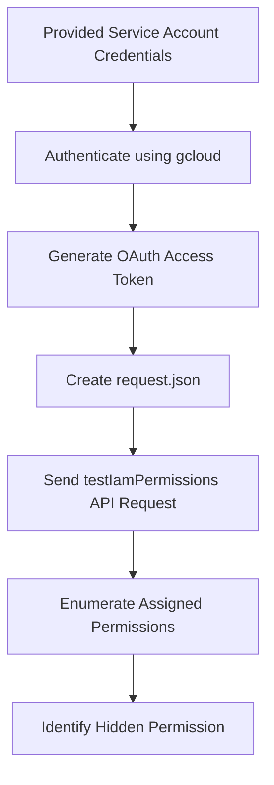
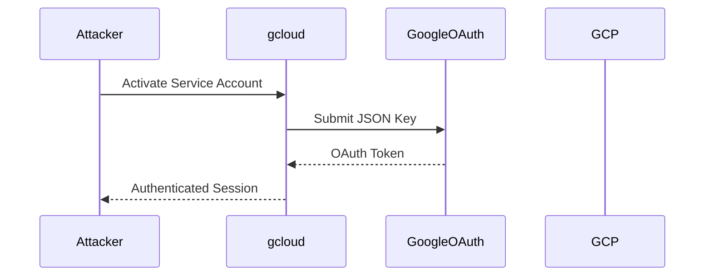
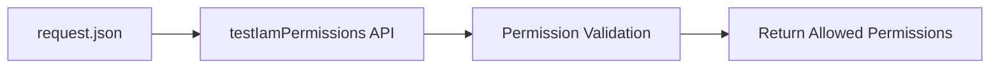
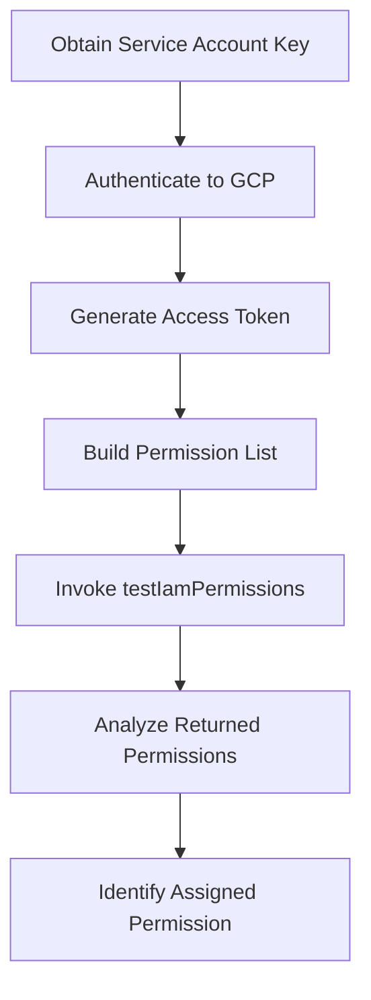

# Solution — GCP IAM Permission Enumeration Lab

# Overview

This lab focuses on enumerating IAM permissions in Google Cloud using the `testIamPermissions()` API method.

The objective is to identify which permissions are assigned to the currently authenticated service account and discover the hidden permission/flag.

---

# Attack Flow


---
# Prerquisities
## need to install gcloud in the kali if you are doinf it in the kali linux
here are the commands for downloading it :

step 1:
```bash
sudo apt install && sudo apt upgrade -y
```
step 2:
```bash
sudo apt install -y apt-transport-https ca-certificates gnupg curl
```
step 3:
```bash
curl https://packages.cloud.google.com/apt/doc/apt-key.gpg | \
sudo gpg --dearmor -o /usr/share/keyrings/cloud.google.gpg
```
step 4:
```bash
echo "deb [signed-by=/usr/share/keyrings/cloud.google.gpg] \
https://packages.cloud.google.com/apt cloud-sdk main" | \
sudo tee /etc/apt/sources.list.d/google-cloud-sdk.list
```
step5:
```bash
sudo apt update
sudo apt install -y google-cloud-cli
```
step 6:
```bash
gcloud version
```
## Attacking Process

# Step 1: Authenticate using Service Account
as we have the credential json file provided in the lab download it 
then 
authenticate using this command
```bash
gcloud auth activate-service-account \
--key-file={filename}.json
```
then if the authentication is successful then you will get this message 
Activated service account credentials for:

[svc-mgmt-sa@woven-acolyte-428406-v9.iam.gserviceaccount.com]

### Authentication Workflow

# Step 2: Setup the project

```bash 
gcloud config set project woven-acolyte-428406-v9
```
by using the above command you can setup the project 
where woven-acolyte-428406-v9 is the project ID

### UNDERSTANDING testIamPermissions():
The testIamPermissions() API checks which permissions from the provided list are assigned to the authenticated identity.

It does NOT enumerate all permissions automatically.

the below diagrma illustrate the permission enumeration flow

# Step 3: Execution Permission Enumeration

create a json file
-> why json file 
to make a checklist of permissions 

then run a curl command of POST method for the permission enumeration
```bash
curl -X POST \
-H "Authorization: Bearer $(gcloud auth print-access-token)" \
-H "Content-Type: application/json; charset=utf-8" \
-d @request.json \
"https://cloudresourcemanager.googleapis.com/v1/projects/woven-acolyte-428406-v9:testIamPermissions"
```
the you will get an response

```json
{
  "permissions": [
    "iam.serviceAccounts.actAs"
  ]
}
```
final answer : Assigned Permission = iam.serviceAccounts.actAs

## Complete enumeration Process

