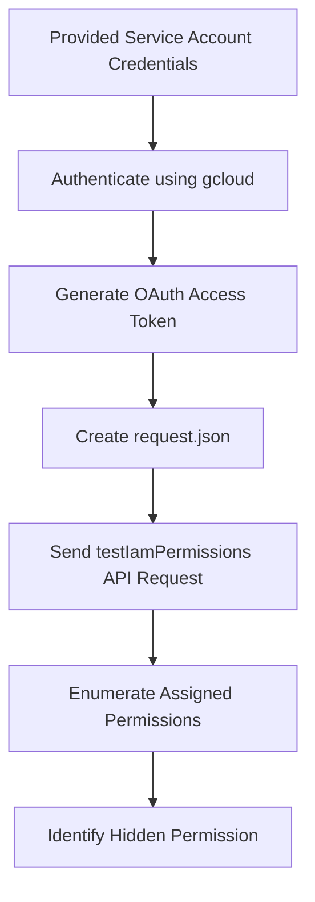

# Solution — GCP IAM Permission Enumeration Lab

# Overview

This lab focuses on enumerating IAM permissions in Google Cloud using the `testIamPermissions()` API method.

The objective is to identify which permissions are assigned to the currently authenticated service account and discover the hidden permission/flag.

---

# Attack Flow


---
## Prerquisities
# need to install gcloud in the kali if you are doinf it in the kali linux
here are the commands for downloading it :

step 1:
```bash
sudo apt install && sudo apt upgrade -y
```
