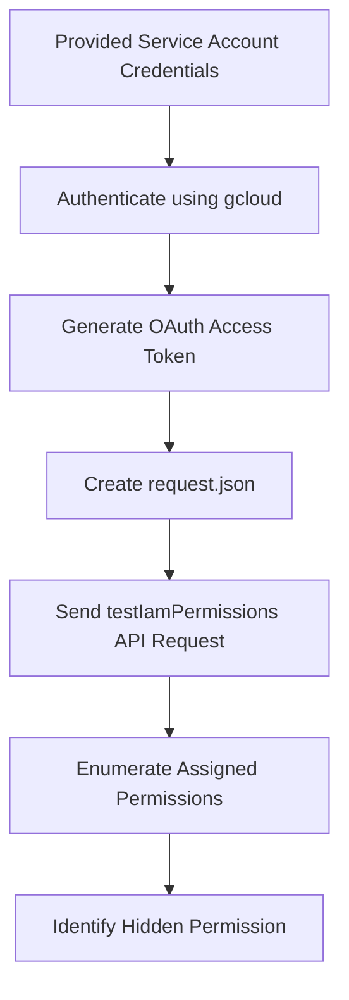

# Solution — GCP IAM Permission Enumeration Lab

# Overview

This lab focuses on enumerating IAM permissions in Google Cloud using the `testIamPermissions()` API method.

The objective is to identify which permissions are assigned to the currently authenticated service account and discover the hidden permission/flag.

---

# Attack Flow


---
## Prerquisities
# need to install gcloud in the kali if you are doinf it in the kali linux
here are the commands for downloading it :

step 1:
```bash
sudo apt install && sudo apt upgrade -y
```
step 2:
```bash
sudo apt install -y apt-transport-https ca-certificates gnupg curl
```
step 3:
```bash
curl https://packages.cloud.google.com/apt/doc/apt-key.gpg | \
sudo gpg --dearmor -o /usr/share/keyrings/cloud.google.gpg
```
step 4:
```bash
echo "deb [signed-by=/usr/share/keyrings/cloud.google.gpg] \
https://packages.cloud.google.com/apt cloud-sdk main" | \
sudo tee /etc/apt/sources.list.d/google-cloud-sdk.list
```
step5:
```bash
sudo apt update
sudo apt install -y google-cloud-cli
```
step 6:
```bash
gcloud version
```